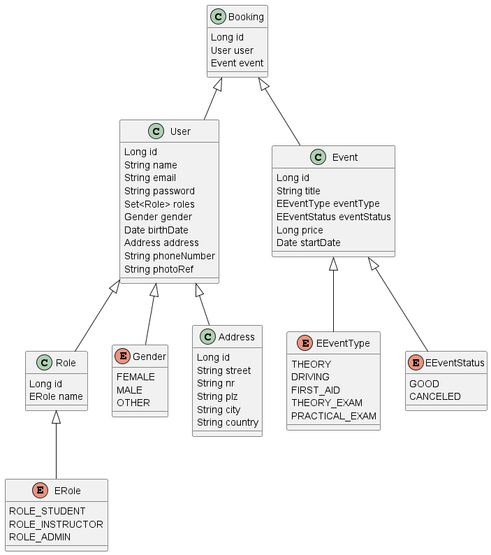

# Driving School Booking App - Backend

Backend for the Driving School App

## Application configuration
Open `src/main/resources/application.properties`

### Database configuration
```
spring.datasource.url=jdbc:mariadb://localhost:3306/dsbdb
spring.datasource.username=root
spring.datasource.password=root
spring.datasource.driver-class-name=org.mariadb.jdbc.Driver
spring.jpa.hibernate.ddl-auto=create
spring.jpa.show-sql=true
```

### MinIO configuration
```
minio.url=http://127.0.0.1:9000/
minio.accessKey=minioadmin
minio.secretKey=minioadminpw
minio.bucketName=files
```

### JWT configuration
```
jwt.secret=2D4A614E645267556B58703273357638792F423F4428472B4B6250655368566D
jwt.cookieName=bookingCookie
jwt.expirationMs=86400000
```

### Swagger configuration
```
springdoc.api-docs.path=/api/docs
springdoc.swagger-ui.path=/swagger.html
```

## DB Class model

Open `src/main/resources/DatabaseModel.puml`



## Run Spring Boot application
```
mvn spring-boot:run
```

## Verify DB content with SQL statements of this file
Open `sql/dbqueries.sql`
```
select * from dsbdb.roles;
select * from dsbdb.country;
select * from dsbdb.users;
```

